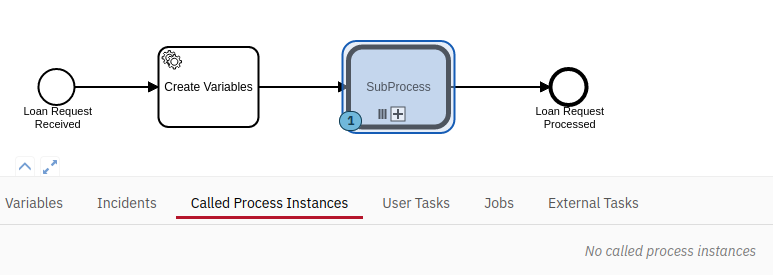
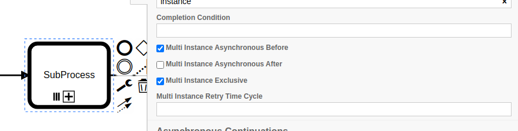

# This repository shows issues with the camunda sub process instance management

## What exactly is the issue

Having Multi Instance Call Activities with many instances and a lot of process variables provokes an issue were there are no Mutli Instance Bodies created.

Depending on the amount of instances and process variables, this solves itself after a few minutes. But if certain thresholds are exceeded (see test results below), it gets into failure state where the instances are not created and the negative effects listed below appear.

## Test results with the provided example project

The following table demonstrates for the given example, how many instances can be created with how many process
variables via in and out mapping.

Values that are ~~marked~~ via strike through produce the issue.

|       | Vars | 0     | 1         | 5         | 10        | 25         | 50         | 100        | 200         | 500         | 1000        |
|-------|------|-------|-----------|-----------|-----------|------------|------------|------------|-------------|-------------|-------------|
| Inst  |      |       |           |           |           |            |            |            |             |             |             |
| 10    |      | 0     | 10        | 50        | 100       | 250        | 500        | 1000       | 2000        | 5000        | 10000       |
| 50    |      | 0     | 50        | 250       | 500       | 1250       | 2500       | 5000       | 10000       | 25000       | 50000       |
| 60    |      | 0     | 60        | 300       | 600       | 1500       | 3000       | 6000       | 12000       | 30000       | 60000       |
| 70    |      | 0     | 70        | 350       | 700       | 1750       | 3500       | 7000       | 14000       | 35000       | 70000       |
| 80    |      | 0     | 80        | 400       | 800       | 2000       | 4000       | 8000       | 16000       | 40000       | 80000       |
| 90    |      | 0     | 90        | 450       | 900       | 2250       | 4500       | 9000       | 18000       | 45000       | 90000       |
| 100   |      | 0     | 100       | 500       | 1000      | 2500       | 5000       | 10000      | 20000       | 50000       | ~~100000~~  |
| 250   |      | 0     | 250       | 1250      | 2500      | 6250       | 12500      | 25000      | 50000       | ~~125000~~  | ~~250000~~  |
| 500   |      | 0     | 500       | 2500      | 5000      | 12500      | 25000      | 50000      | ~~100000~~  | ~~250000~~  | ~~500000~~  |
| 1000  |      | 0     | 1000      | 5000      | 10000     | 25000      | 50000      | ~~100000~~ | ~~200000~~  | ~~500000~~  | ~~1000000~~ |
| 2500  |      | 0     | 2500      | 12500     | 25000     | ~~62500~~  | ~~125000~~ | ~~250000~~ | ~~500000~~  | ~~1250000~~ | ~~2500000~~ |
| 5000  |      | 0     | 5000      | ~~25000~~ | ~~50000~~ | ~~125000~~ | ~~250000~~ | ~~500000~~ | ~~1000000~~ | ~~2500000~~ | ~~5000000~~ |
| 10000 |      | ~~0~~ | ~~10000~~ | ~~25000~~ | ~~50000~~ | ~~125000~~ | ~~250000~~ | ~~500000~~ | ~~1000000~~ | ~~2500000~~ | ~~5000000~~ |

## Negative impacts of this problem

There is no error message shown, both in the logs and the Camunda Cockpit. Thus, it is hard to detect in production. 

A side effect of this issue is, that tremendous amounts of data are written to the database, leading to space problems and as a consequence application shutdowns.

The issue provokes high CPU load.

## What was missing to prevent this issue

The configuration of a Multi Instance Call Activity allows to enable the following checkbox (thanks to the Camunda enterprise support team for helping us out):

This leads in the above extremer examples to high run times and plenty of CPU usage, so use with caution.
Keep in mind, that Camunda as a software provider states in the docs to [store as few variables as possible within Camunda](https://docs.camunda.io/docs/components/best-practices/development/handling-data-in-processes/#storing-just-the-relevant-data).